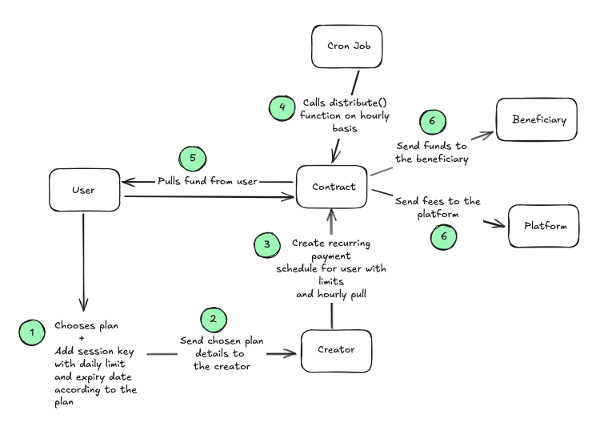

# Recurring Finance 💰

Recurring Finance is a decentralized application that automates cryptocurrency payments through a singleton distributor contract architecture. The system leverages smart wallet delegation and session keys to enable users to set up recurring payments with custom schedules, beneficiaries, and spending limits.


### Flowchart



## Architecture Components
### On-Chain Components
1. Singleton Distributor Contract: 
   - Single smart contract that manages all recurring payments across all users 
   - Added `CREATOR_ROLE` to restrict access to scheduled payment creation
   - Added pausable functionality to prevent contract exploits
   - Added a default 2% platform fee which can be customized by the `ADMIN`
2. Session Key Management with EIP 7702: Handles delegation of spending authority with daily limits and expiration dates
3. Gas Optimization: 
   - Eliminates per-user distributor contract deployment costs
   - Reduces storage slots by packing related variables
   - Replaced EnumerableSet with Arrays
   - Optimized cron schedule validation with bitmasking to do validation in O(n) time which was previously O(n^2)

#### Off-Chain Components
1. Cron Job Scheduler
   - Automated Execution: Runs on hourly basis to trigger payment distributions
   - Smart Triggering: Calls the distribute() function on the singleton contract

2. Frontend Application (Next.js)
3. Relayer Infrastructure: Relayers execute transactions on behalf of users to create the recurring payment schedule

### Singleton Approach Advantages
1. Cost Efficiency: No contract deployment costs per user
2. Simplified Maintenance: Single contract to maintain and upgrade
3. Cross-User Operations: Easy implementation of global features
4. Reduced Attack Surface: One well-audited contract
5. Platform Economics: Centralized fee collection and analytics 

## 🌟 Features

### Core Functionality
- **Smart Wallet Integration**: Generate and manage smart EOA (Externally Owned Account) wallets
- **Session Key Management**: Delegate spending authority to relayers with daily limits and expiration dates
- **Recurring Payments**: Set up automated payments with complex cron-like schedules
- **Multi-Beneficiary Support**: Send payments to multiple recipients in a single transaction
- **Token Flexibility**: Support for any ERC-20 token (USDC, ETH, etc.)

### Advanced Scheduling
- **Flexible Timing**: Set start and end dates for payment schedules
- **Cron-like Scheduling**: Configure payments to run on specific:
  - Hours (24-hour format)
  - Days of the week
  - Days of the month
  - Months of the year
- **Real-time Preview**: Visual feedback showing your configured schedule

### Security & Control
- **Spending Limits**: Set daily spending limits for delegated accounts
- **Time-bound Delegation**: Session keys automatically expire
- **Smart Contract Security**: Built on audited smart contract patterns
- **Relayer Architecture**: Secure execution through trusted relayers

## 🏗️ Architecture

### Smart Contracts
- **Distributor**: Handles recurring payment logic and execution
- **Session Key System**: Manages delegation and spending limits

### Frontend Stack
- **Next.js 14**: React framework with App Router
- **TypeScript**: Type-safe development
- **Tailwind CSS**: Utility-first styling
- **Wagmi**: Ethereum React hooks
- **Viem**: TypeScript Ethereum library
- **Lucide React**: Beautiful icons

### Web3 Integration
- **Smart Wallet Support**: ERC-7702 compatible
- **Multi-chain Ready**: Ethereum and compatible networks

## 🚀 Getting Started

### Installation

1. **Clone the repository**
   ```bash
   git clone https://github.com/rahulbansal123/recurring-finance.git
   cd recurring-finance/client
   ```

2. **Install dependencies**
   ```bash
   npm install
   # or
   yarn install
   ```

3. **Environment Setup**
   
   Create a `.env` file in the root directory:
    ```env
    NEXT_PUBLIC_PRIVATE_KEY=
    ```
    For local development, you can use the following private key:
    ```env
    NEXT_PUBLIC_PRIVATE_KEY=0x22ea21180cde9a963a303deb128a1d04bcf8e4735492d53c1dfd040522c18b04
    ```


4. **Start the development server**
   ```bash
   npm run dev
   # or
   yarn dev
   ```

5. **Open your browser**
   Navigate to [http://localhost:3000](http://localhost:3000) to see the application.


## 💡 Usage

### Setting Up Recurring Payments

1. **Connect Your Wallet**
   - Click "Generate Wallet" to create a new smart wallet

2. **Add Session Key**
   - Distributor contract address is used as the delegated relayer address
   - Choose plan
   - Sign the delegation transaction

3. **Distribute**
   - Anyone can distribute the payments to all beneficiaries

## 🙏 Acknowledgments

- **OpenZeppelin** 
- **Viem and Wagmi**
- **Tailwind CSS**
- **Next.js**
